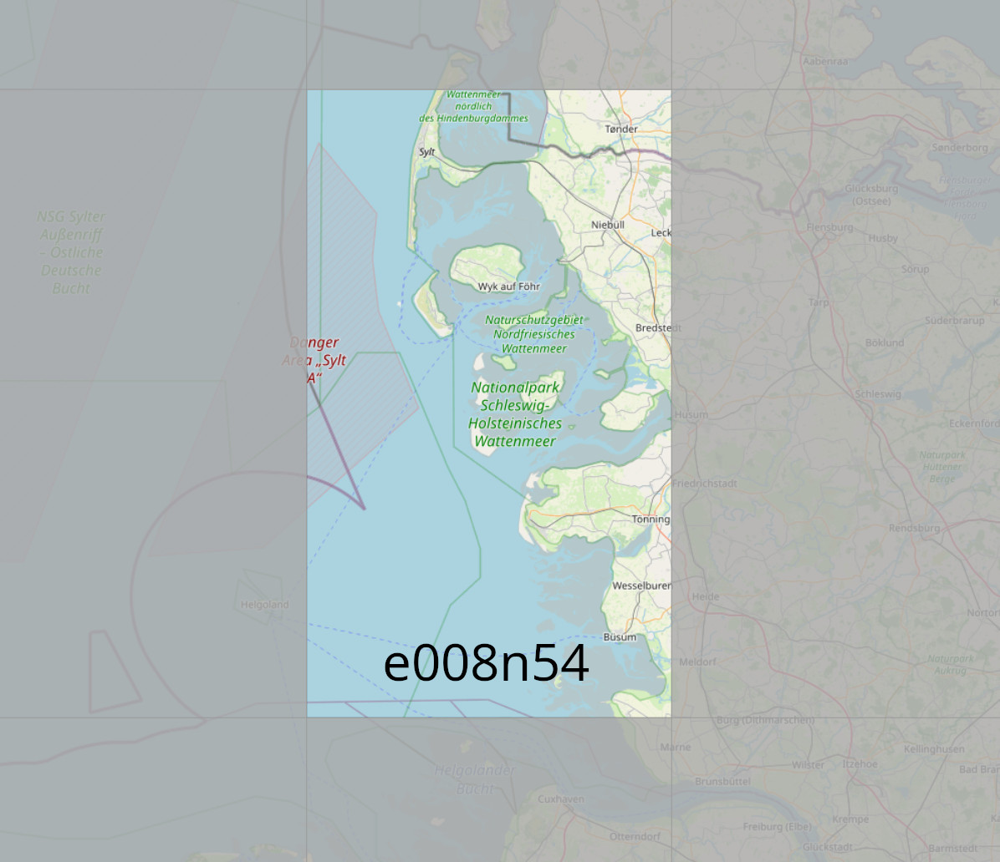

# Nordfriesland-custom-scenery
FlightGear custom scenery for the Nordfreisland region, Germany

### This package contains:

*  Westerland Sylt Airport (EDXW)
	* upgraded airport layout
	* airport buildings
	* navaids
	* FMS procedures
	* more customized buildings/cleanup (todo)
* Wyk auf Foehr (EDXY)
	* new airport layout
	* customized airport buildings
	* new parkingpositions
* Toender (EKTD)
	* upgraded airport layout
* Aventoft
	* upgraded airport layout
* Leck (EDXK)
	* upgraded airport layout
* Pellworm (EDHP)
	* upgraded airport layout
* St. Peter Ording (EDXO)
	* upgraded airport layout
* Heide Buesum (EDXB)
	* upgraded airport layout
* Bredstedt UL
	* include airport layout

### Coverage:
        

        
### Requirements:

* latest set of shared objects:
	http://flightgear.sourceforge.net/scenery/Models/
        
### Data sources:

* SRTM-3 global elevation data:
	http://viewfinderpanoramas.org/Coverage%20map%20viewfinderpanoramas_org3.htm
* CORINE landcover data:
	https://land.copernicus.eu/pan-european/corine-land-cover/clc2018?tab=mapview
* OSM landmass data:
	https://osmdata.openstreetmap.de/data/land-polygons.html
* x-Plane detailed airports:
	https://gateway.x-plane.com
* FlightGear terrasync objects:
	https://scenery.flightgear.org/
* FMS-procedures hosted by pinto:
	https://github.com/l0k1/fg-navaiddata
* osm2city:
	https://gitlab.com/osm2city
* osm raw data:
	https://download.geofabrik.de/

### Special thanks to:

* D-ECHO
* d-laser (https://github.com/mherweg/d-laser-fgtools)
    
    
Sven Seipp, September 2021
